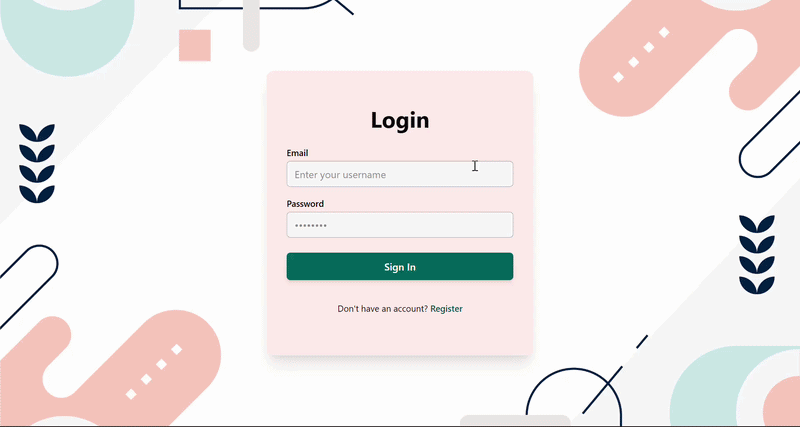

# Expense Tracker

A full-stack expense management application built with Spring Boot and React, featuring a hand-rolled OAuth2 Authorization Server and Resource Server implementing the Authorization Code with PKCE flow end-to-end, paired with automated keep-alive monitoring and containerized deployment.

**Live App:** [expense-tracker-backend-55wg.onrender.com](https://expense-tracker-backend-55wg.onrender.com)
**Repository:** [github.com/ks9205124-cloud/expenseTracker](https://github.com/ks9205124-cloud/expenseTracker)

## Demonstration



## Why This Project

This project was built as a dual-purpose engineering challenge: to move beyond basic tutorials into full-scale React frontend development and to master identity and access management by building a custom OAuth2 Authorization Server rather than outsourcing authentication to third-party providers like Auth0 or Firebase.

Implementing a custom authorization server forced a deep understanding of core security primitives, including PKCE code challenge generation, token exchange, custom security filter chains, CORS configurations, and role-based access control. Additionally, production deployment introduced real-world constraints such as handling Render cold starts via automated cron jobs, managing cross-origin cookie restrictions, and packaging both backend and frontend into a unified deployment artifact.

## Features

- **Custom OAuth2 + PKCE Authentication:** Self-hosted Spring Authorization Server managing the full token issuance and exchange cycle, from client registration to JWT-based session handling.
- **Role-Based & Method-Level Authorization:** Endpoint access secured via granular request matchers, authority checks, and custom authentication success handlers.
- **User Registration & Login:** Complete account creation workflow featuring BCrypt password hashing and automatic default category seeding for new users.
- **Category & Expense Management (CRUD):** Comprehensive record management with strict relational checks (preventing category deletion if linked expenses exist) and precise monetary calculations using BigDecimal.
- **Automated Keep-Alive Monitoring:** Configured with an external cron service via cron-job.org to ping a public health check endpoint (`/api/health`) every 10 minutes, preventing server spin-down on free-tier cloud hosting.
- **Responsive User Interface:** Modern, clean interface designed with Tailwind CSS and React Router.

## Tech Stack & Infrastructure

| Layer | Technology | Description |
|---|---|---|
| Frontend | React (Vite), Tailwind CSS, React Router v6 | Single-page application handling UI routing, components, and PKCE parameter generation. |
| Backend | Java, Spring Boot, Spring Security | Core business logic, REST controllers, and decoupled Authorization/Resource Server filter chains. |
| Database | MySQL | Relational data persistence for users, authorities, categories, and expenses. |
| Containerization | Docker & Docker-Compose | Multi-stage build packaging backend and static frontend assets into a single reproducible image. |
| Hosting & Cloud | Render | Production environment serving the unified application over HTTPS with managed public URLs. |
| Monitoring | Cron-job.org | Automated background pings to the `/api/health` endpoint to maintain uptime on cloud infrastructure. |

## Architecture & Auth Flow

The backend utilizes a decoupled, multi-tier security filter chain architecture separating the OAuth2 Authorization Server from the Resource Server.

```
Frontend (React + PKCE) 
    │
    ├─ 1. Generates code_verifier / code_challenge
    ├─ 2. Redirects to Authorization Server (/oauth2/authorize)
    └─ 3. Exchanges authorization code for tokens
        │
        ▼
Spring Boot Backend (OAuth2 Authorization Server + Resource Server)
    ├─ WebAuthorizationConfig.java (Resource Server filter chain & CORS)
    ├─ AuthorizationServerConfig.java (OAuth2 client registration & tokens)
    ├─ CustomAuthenticationProvider.java (DB-backed authentication)
    └─ MySQL Database (Users, Authorities, Categories, Expenses)
```

## Project Structure

```
expenseTracker/
├── src/main/java/com/shaurya/spring/expensetracker/
│   ├── controller/
│   │   ├── CategoryController.java
│   │   ├── ExpenseController.java
│   │   ├── HealthController.java
│   │   ├── SpaController.java
│   │   └── UserController.java
│   ├── dto/
│   │   ├── CreateCategoryRequest.java
│   │   ├── CreateExpenseRequest.java
│   │   └── CreateUserRequest.java
│   ├── exception/
│   │   ├── DuplicateResourceException.java
│   │   ├── GlobalExceptionHandler.java
│   │   └── ResourceNotFoundException.java
│   ├── model/
│   │   ├── Authority.java
│   │   ├── Category.java
│   │   ├── Expense.java
│   │   └── User.java
│   ├── repository/
│   │   ├── CategoryRepository.java
│   │   ├── ExpenseRepository.java
│   │   ├── RsaKeyRepository.java
│   │   └── UserRepository.java
│   ├── security/
│   │   ├── AuthenticationLoggingFilter.java
│   │   ├── CustomAuthenticationSuccessHandler.java
│   │   ├── CustomAuthenticationProvider.java
│   │   ├── JpaUserDetailsService.java
│   │   ├── RequestLoggingFilter.java
│   │   └── SecurityUser.java
│   ├── service/
│   │   ├── CategoryService.java
│   │   ├── ExpenseService.java
│   │   └── UserService.java
│   ├── AuthorizationServerConfig.java
│   ├── ExpenseTrackerApplication.java
│   ├── SecurityBeansConfig.java
│   ├── UserManagementConfig.java
│   └── WebAuthorizationConfig.java
├── src/main/resources/
│   ├── templates/
│   └── application.properties
├── src/test/
├── frontend/
│   ├── public/
│   └── src/
│       ├── assets/
│       │   ├── hero.png
│       │   ├── login-bg.jpg
│       │   ├── react.svg
│       │   └── vite.svg
│       ├── components/
│       │   ├── AsyncButton.jsx
│       │   └── ErrorToastContainer.jsx
│       ├── pages/
│       │   ├── CallbackPage.jsx
│       │   ├── DashboardPage.jsx
│       │   ├── LoginPage.jsx
│       │   └── RegisterPage.jsx
│       ├── services/
│       │   ├── api.js
│       │   ├── authService.js
│       │   └── errorToastStore.js
│       ├── App.jsx
│       ├── index.css
│       ├── main.jsx
│       └── ProtectedRoute.jsx
│   ├── index.html
│   ├── package.json
│   ├── vite.config.js
│   └── README.md
├── Dockerfile
├── HELP.md
├── mvnw / mvnw.cmd
├── pom.xml
└── README.md
```

## Getting Started

### Prerequisites

- JDK 17 or higher
- Node.js (v18+)
- Maven
- MySQL Server (or Docker setup)

### Local Setup

Clone the repository:

```bash
git clone https://github.com/ks9205124-cloud/expenseTracker.git
cd expenseTracker
```

Run the backend:

```bash
./mvnw spring-boot:run
```

Run the frontend (in a separate terminal):

```bash
cd frontend
npm install
npm run dev
```

Alternatively, run everything via Docker:

```bash
docker-compose up --build
```

## Current Limitations & Honest Assessment

- **Session Persistence:** Sessions currently terminate upon closing the browser window. Implementing a refresh token flow is planned for a future update.
- **CSRF Handling:** CSRF protection is explicitly bypassed for specific auth paths (`/login`, `/register`, `/api/**`) to streamline token and session exchange for this SPA architecture, which can be hardened further in production.
- **Visualizations:** The UI tracks and lists expenses accurately, but graphical chart breakdowns (such as category pie charts) are scheduled for the next development iteration.

## Lessons Learned

- **Production Security Constraints:** Local development environments are forgiving with cookies and CORS. Transitioning to production on HTTPS required strict configuration of cookie flags (`SameSite=None`, `Secure`) and explicit CORS mapping.
- **Infrastructure Management:** Cloud free tiers introduce spin-down latency. Integrating an external health-check monitor via cron-job.org solved availability drops without incurring server costs.
- **Filter Chain Isolation:** Separating the OAuth2 Authorization Server filter chain from the standard application API filter chain requires precise order annotations and URL matching rules to prevent redirect loops.

## License

Distributed under the MIT License. See `LICENSE` for more information.